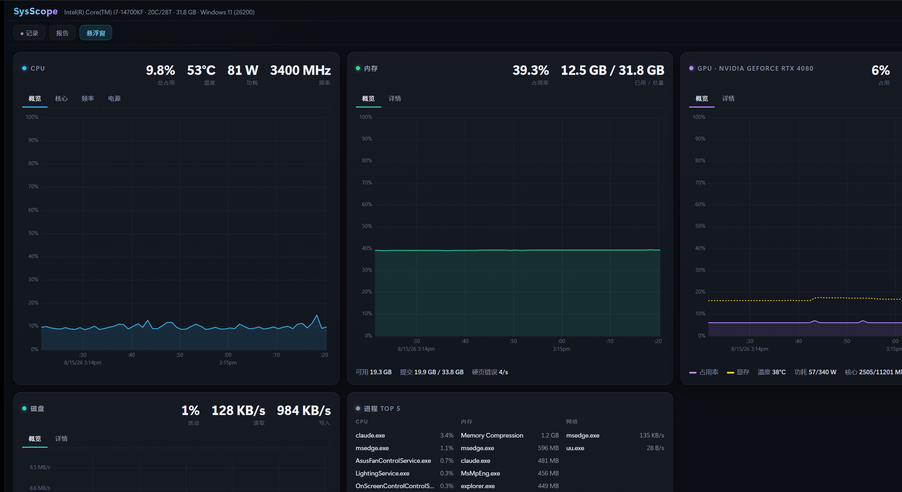

# SysScope

**A professional-grade system monitor for Windows — deep hardware metrics, a game overlay, and exportable reports.**

[](LICENSE)
[](#requirements)
[](https://tauri.app)

[简体中文](README.zh-CN.md)



SysScope watches six subsystems — CPU, GPU, memory, disk, network and processes —
and shows each of them at two levels: a live chart at a glance, and a detail tab
with the numbers you actually need when something is wrong (thermal throttling,
power limits, queue depth, retransmits, per-process GPU usage…).

It samples in **~20 ms per tick**, so even the 0.5 s interval costs a few percent
of one core.

---

## Highlights

**Depth, not just gauges.** Most lightweight monitors stop at "CPU 42%".
SysScope also tells you *why*: package power and per-core clocks, whether the CPU
is thermally throttling, whether the GPU hit its power limit, if the disk queue is
backing up, or if memory pressure is causing hard page faults.

| Subsystem | What you get |
|---|---|
| **CPU** | Total & per-core load, P/E-core grouping, package power, core voltage, per-core clocks, effective clock, C-state residency, boost state, thermal-throttle flag |
| **GPU** | Load, VRAM, core/memory clocks, temperature + hotspot + VRAM temp, power vs. power limit, fan %/RPM, memory-controller load, encode/decode engines, PCIe throughput, **hardware throttle reasons** |
| **Memory** | Used/available/cached, standby & modified page lists, commit charge and ratio, hard & soft page-fault rates, memory compression, DIMM speed and theoretical bandwidth |
| **Disk** | Per-drive read/write throughput, IOPS, **sub-millisecond response times**, queue length, free space, SSD health / TBW / temperature (SMART) |
| **Network** | Per-adapter throughput, ICMP latency with jitter and packet loss, TCP connection states, retransmission rate, link utilization |
| **Processes** | Top 5 by CPU, memory, disk, network **and GPU**; click any row for threads, handles, working set, private bytes, page faults, priority and CPU affinity |

**FPS overlay for games.** A borderless always-on-top strip that follows whatever
app is in the foreground and shows its frame rate next to CPU/GPU/memory/network.
Frame data comes from ETW (DXGI/D3D9 present events), the same source PresentMon
uses — including 1% / 0.1% lows, frame-time percentiles and stutter counts.


**Record and report.** Capture a monitoring session to SQLite, then export it as a
self-contained **HTML report with interactive charts**, raw **CSV/JSON**, or a
**Markdown** summary with averages, peaks and threshold violations.

---

## Download

Grab the latest installer from the [Releases page](../../releases).

`SysScope_x.y.z_x64_en-US.msi` — about 7 MB.

## Requirements

- Windows 10 or 11, x64
- **Administrator rights** — the app requests elevation on launch. FPS capture
  needs an ETW kernel session and temperature readings need a kernel driver;
  neither works without it. Everything else degrades gracefully.
- WebView2 runtime — preinstalled on Windows 11 and recent Windows 10
- NVIDIA GPUs get the full metric set (via NVML). AMD and Intel GPUs fall back to
  load and VRAM via performance counters.

Reports are written to `Documents\SysScope\reports`.

---

## Building from source

You need [Rust](https://rustup.rs) (MSVC toolchain) and Node.js 20+.

```bash
npm install
npm run tauri dev     # run in development
npm run tauri build   # produce an installer
```

The sensor bridge (`sensor-bridge/`, a NativeAOT-compiled C# DLL wrapping
LibreHardwareMonitor) is **already committed as a prebuilt DLL**, so changes to
the Rust or frontend code need no extra toolchain. Rebuild it only if you touch
the bridge itself — that needs the .NET 9 SDK plus the VS C++ toolchain:

```bash
cd sensor-bridge && dotnet publish -c Release -r win-x64
```

Copy the output to `src-tauri/resources/sysscope_sensors.dll`. If the linker
cannot find `vswhere`, run it from a VS Developer Prompt or add
`C:\Program Files (x86)\Microsoft Visual Studio\Installer` to `PATH`.

### Tests

```bash
cd src-tauri && cargo test                        # 24 pure-logic tests, CI-safe
cd src-tauri && cargo test -- --include-ignored   # + 8 tests needing real hardware
```

The hardware tier is marked `#[ignore]` because it needs admin rights, a GPU and
a live desktop session.

Before shipping a build, run the smoke test — it verifies the app *works*, not
merely that a process exists (it has caught real regressions that process checks
missed):

```bash
powershell -ExecutionPolicy Bypass -File scripts/smoke-test.ps1
```

---

## How it works

Collection runs on a single sampling thread that emits one `Snapshot` per tick to
the frontend. Data comes from whichever API is cheapest and most accurate for
each metric:

| Source | Used for |
|---|---|
| **PDH** performance counters | Disk I/O, memory internals, CPU perf/C-states, TCP & adapter stats, per-process GPU |
| **NVML** | Full NVIDIA GPU telemetry |
| **ETW** | Frame times (DXGI/D3D9) and per-process network bytes |
| **LibreHardwareMonitor** (via a NativeAOT C ABI bridge) | Temperatures, CPU power/voltage, per-core clocks, SMART |
| **sysinfo / IpHelper / Win32** | Process tables, connection tables, topology |

A note on PDH: an early version queried `Win32_PerfFormattedData_*` over WMI and
each tick cost **1.7 seconds**, because every one of those queries blocks for an
internal sampling window. Moving to a single PDH query handle cut a tick to
**20 ms**. If you are writing a Windows monitor, do not poll formatted WMI
counters in a loop.

Source layout is documented in [docs/ARCHITECTURE.md](docs/ARCHITECTURE.md).

---

## Contributing

Issues and pull requests are welcome. If you are reporting a bug, the smoke-test
output and a screenshot help a lot. Note that most collectors can only be
verified on real hardware, so please mention your CPU/GPU when a metric looks
wrong.

## License

[MIT](LICENSE) © lu020218

Third-party components — most importantly LibreHardwareMonitor (MPL-2.0) — are
listed in [NOTICE](NOTICE).
